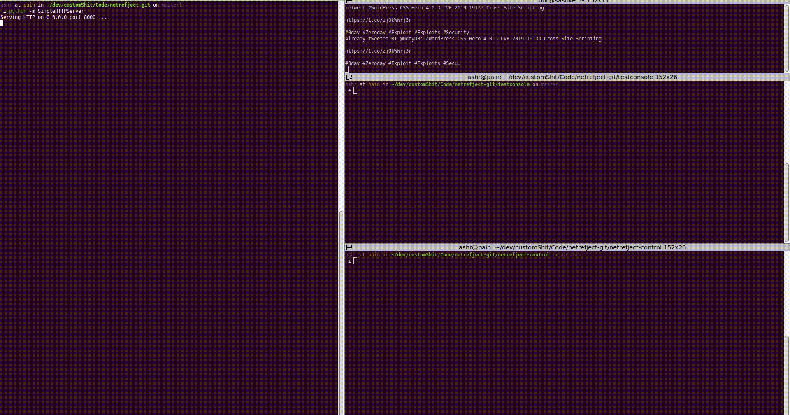

netrefject is a small POC to show how to use Mono.Cecil to inject
.Net payloads into .Net assemblies if you have write access to those assemblies 

(And I assume they need to be unsigned but I haven't tested - though it seems obvious)

I have not seen this functionality in various C2/payload frameworks yet, just in-memory injection

This project is being developed on Linux with vscode, running dotnet core 2, 
just committed a fix to allow you to debug with vscode and be able to send stdinput during debugging. 

[Current State]

Full payload injection with remote and local .Net payloads !

[End Current]

More payloads and some refined code coming soon !
