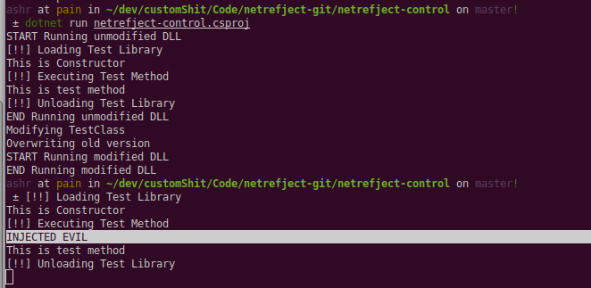
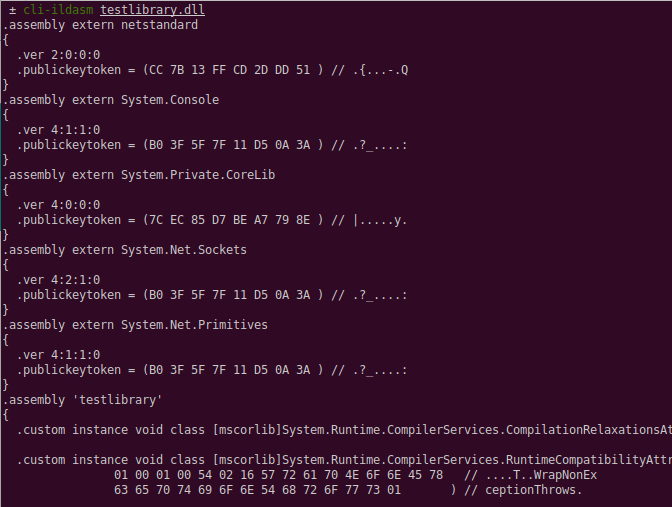
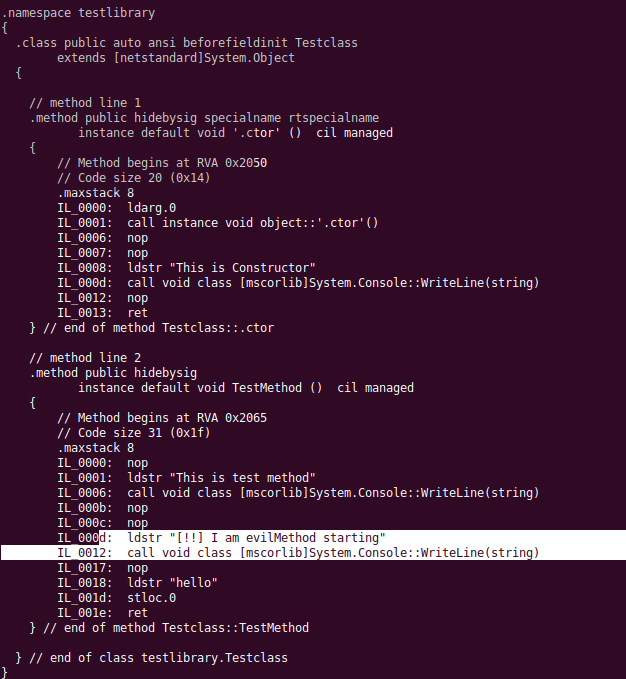

netrefject is a small POC to show how to use Mono.Cecil to inject
.Net payloads into .Net assemblies if you have write access to those assemblies 

(And I assume they need to be unsigned but I haven't tested - though it seems obvious)

I have not seen this functionality in various C2/payload frameworks yet, just in-memory injection

This project is being developed on Linux with vscode, running dotnet core 2, 
just committed a fix to allow you to debug with vscode and be able to send stdinput during debugging. 

[Current State]

I have commented out the bulky module selection stuff to debug the current code to fix what i've mentioned below

The current state works by injecting a Console.WriteLine as you can see from the screenshot

Seems like my ideas are working, just need to kill ze bugs

[End Current]

The module import code (Injecting Extern calls to native .Net methods) has been modified to import 
and add the extern calls, but there is an issue - if you can help - hook me up please.

If you look at the screenshot below it looks as if the extern method .ver metadata is incorrect - 
i'm busy investigating this and it seems to be the last issue I need to solve to get a proper payload in.

In this screenshot you can see the 'Evil' code has been added to the TestMethod, that part works fine,
just the method refs that needs to be sorted.

